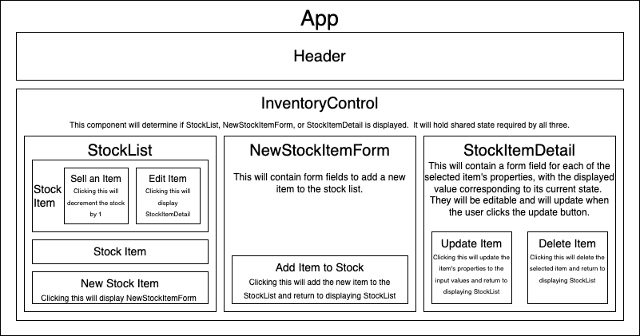

# Local Business Inventory Teacker

#### By Noah Kise

#### A web application to manage the inventory for a fictional trading card game store.

## Technologies Used

* React
* Redux
* Redux Toolkit
* HTML
* CSS
* JavaScript
* Webpack

## Description

This is a web application that lets a shopkeeper manage their inventory of Magic the Gathering products.  They can see an inventory list of every product they have for sale, and use a button to display a form to add a new product to the list.  They can also view and edit the various details of any product, as well as decrement their stock of any individual item by clicking a sell button.

## Component Diagram

## Setup/Installation Requirements

* To run this program locally on your own computer, enter git clone https://github.com/NoahKise/local-business-inventory-tracker in your terminal. Navigate into the project's root folder and run npm install.  Then, type npm run start to run the project on a local server.

## Known Bugs

* The project requirements ask for instances of local and shared state, but I could not think of a good use case for local state, since it seemed every meaningful instance of state needed to be accessed by other components to be functional. Initially I had the number of stock remaining for an item stored locally in StockItem.js, but had to lift it up to InventoryControl.js in order for the stock remaining to not reset after adding or editing an item.

## License

Code licensed under [GPL](LICENSE.txt)

Any suggestions for ways I can improve this app? Reach out to me at noah@kisefamily.com

Copyright (c) December 8 2023 Noah Kise